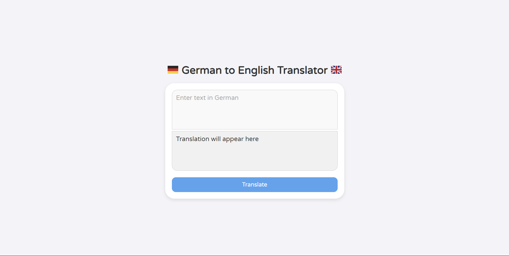
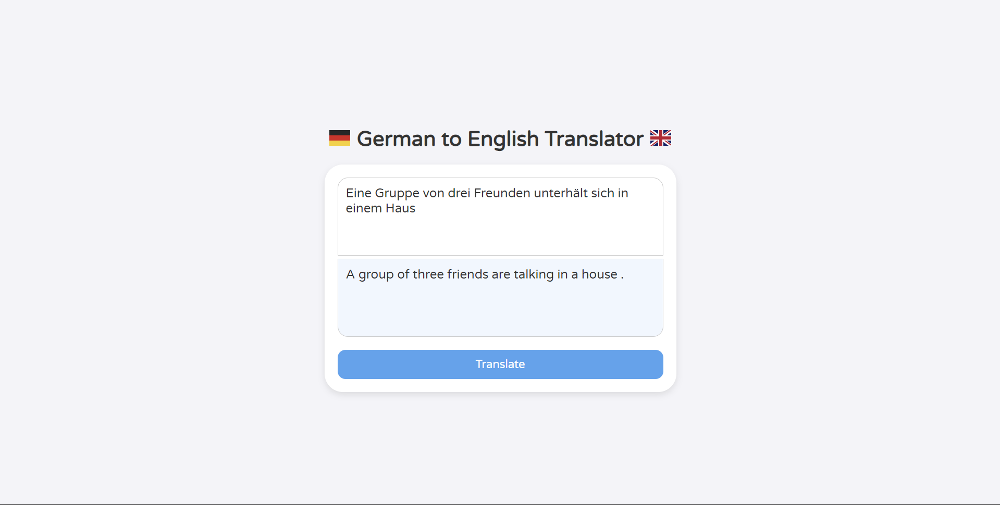
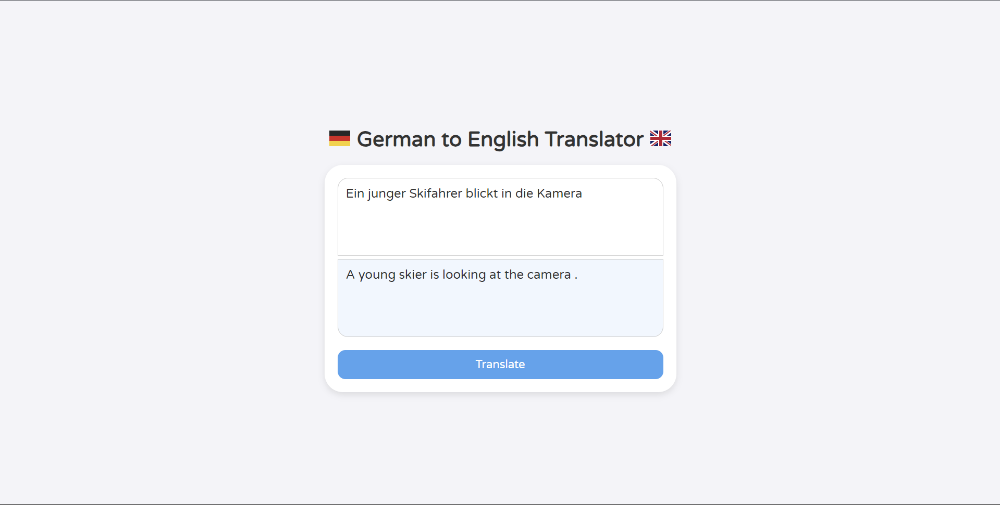
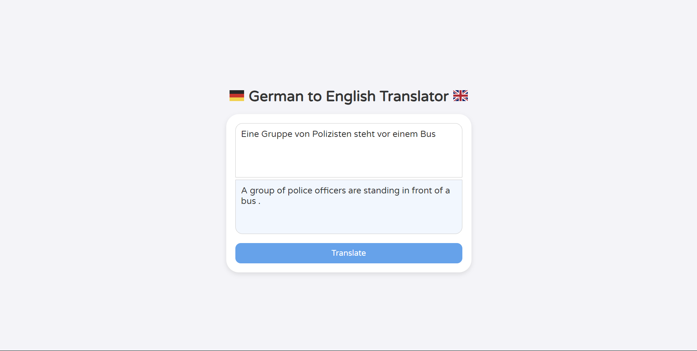
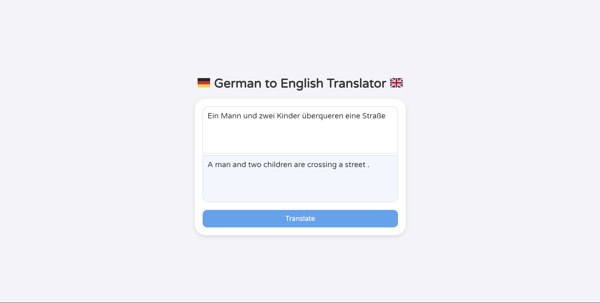
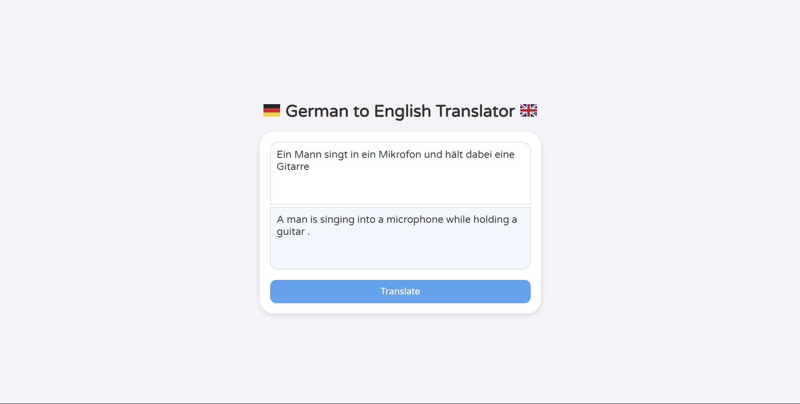
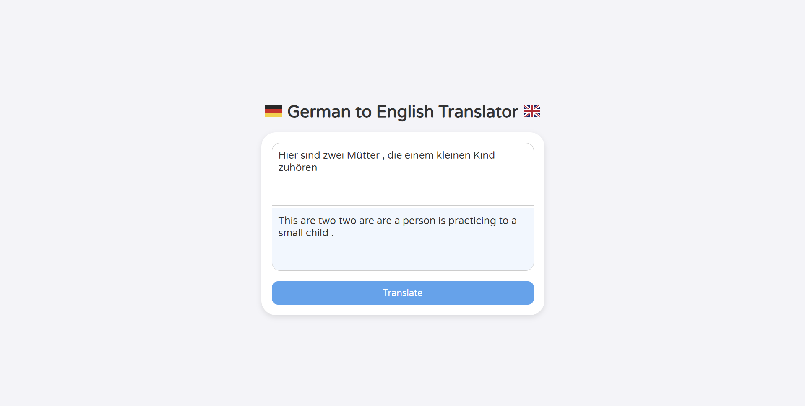

# Machine Translation

This project aims to develop a basic machine translation model where the input is a German sentence, and the output is the corresponding English sentence. The model leverages Gated Recurrent Units (GRUs) and an attention mechanism to enhance translation quality.

[Kaggle Code](https://www.kaggle.com/code/tathya1001/german-to-english-machine-translation)

## Model Architecture
1. **Encoder**: Encodes the German sentence into a context vector using GRUs.
2. **Attention Mechanism**: Allows the decoder to focus on specific parts of the input sentence during translation.
3. **Decoder**: Generates the English sentence word by word using the context vector and the attention mechanism.

## Workflow
1. **Model Training**: The model is trained on a dataset of German-English sentence pairs to learn the translation mappings.
2. **Web Interface**:
   - A Flask application is used to serve the trained model.
   - A JavaScript frontend sends requests to the Flask backend, which returns the translated sentences in real-time.

## Key Features
- Implements attention to improve the translation by dynamically weighting the importance of different parts of the input sentence.
- Provides a user-friendly web interface for interacting with the model.

## Results
Below are some sample translations generated by the model:

Output with inaccurate translation.

## Limitations
- This is not a fully accurate translation application; the project is designed as a demonstration of the Encoder-Decoder architecture with attention.
- The model may produce incorrect or partially accurate translations for complex or uncommon sentences.
